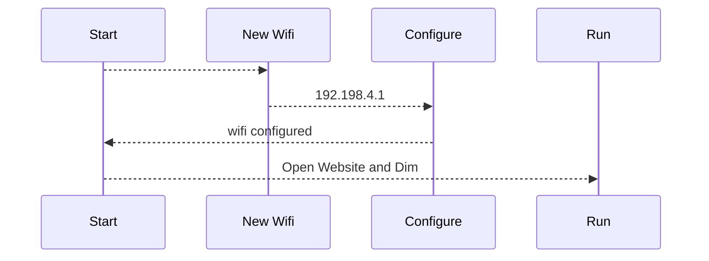
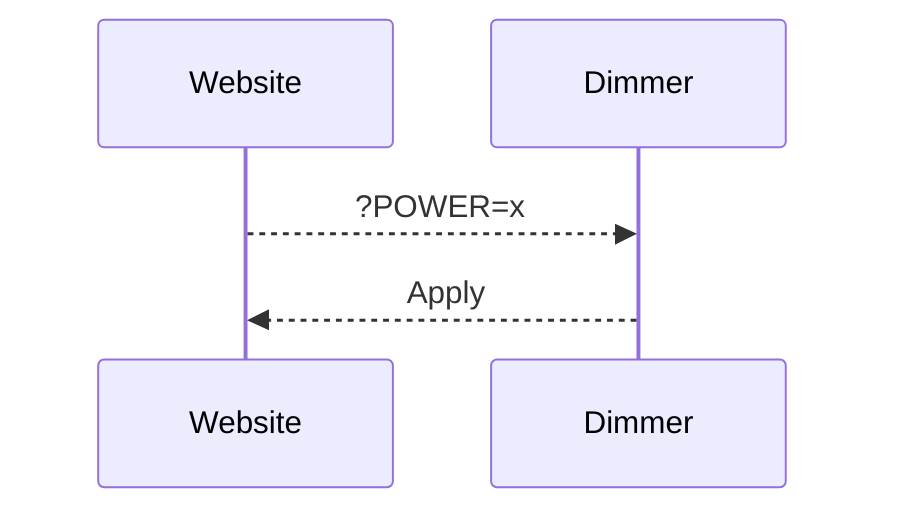

# # Distant dimmer for discharge PV surplus 

I remaster the distant dimmer with the new ALL in dimmer from Robotdyn
https://robotdyn.com/diy-iot-ac-dimmer-kit-esp8266-wi-fi-d1-mini-for-ac-110-240v-dimming-control.html

# Installation

make a git clone of the project and use Visual studio code for build and upload to the board. 
by default, D0 and D1 is used and solt on the board. 
D2 can be used by a Dallas 18b20, I explaint after how to make the small board

# USE

at the first start, the wemos use the Wifimanager for configure the Wifi. 

# CHANGE POWER
for change power use the web site : 
Control :  http://IP/?POWER=xx
xx max = 99 

you can send the command by you domotic server or your pv router 

# Note on Robotdyn librairie
with actual version of arduino GUI or VS, the librairie not working
I modify the librairie and is called in the lib_deps variable
lib_deps = https://github.com/xlyric/RBDDimmer

# Create the Dallas board

on a test plate, solder the long female pin from your Wemos D1 mini 

 

solder a 5.6kOhms resistance between 3.3V hole ( first hole ) 
and D2 ( last hole ) 
and connect 3.3V - GND and D2 to your Dallas 18b20 

 

you can now connect the board to the main board 

