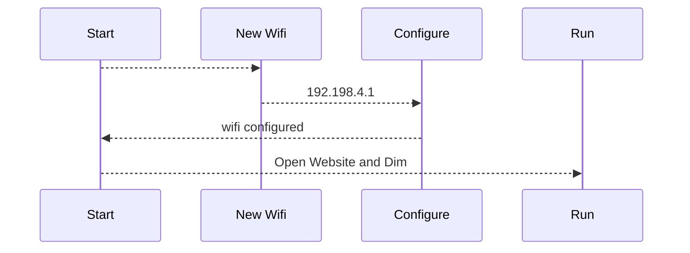
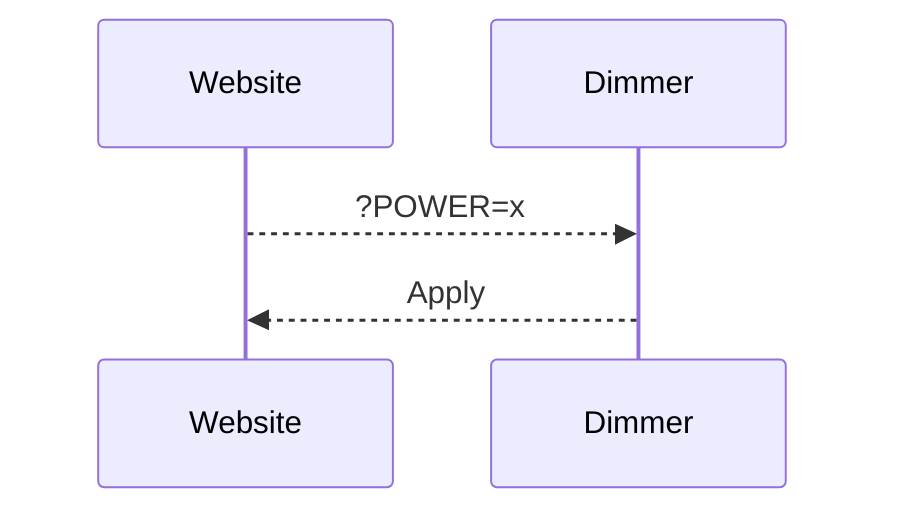

# # Distant dimmer for discharge PV surplus 

[TOC]

I remaster the distant dimmer with the new ALL in dimmer from Robotdyn ( and support 8A !! ) 

# Installation

make a git clone of the project and use Visual Studio Code for build and upload to the board. 
by default, D0 and D1 is used and solt on the board. 
D2 can be used by a Dallas 18b20, I explaint after how to make the small board

 

# USE

at the first start, the wemos use the Wifimanager for configure the Wifi. 

# CHANGE POWER ( for control )
for change power use the web site : 
Control :  http://IP/?POWER=xx
xx max = 99 

you can send the command by you domotic server or your pv router 

# Note on Robotdyn librairie
with actual version of arduino GUI or VS, the librairie not working
I modify the librairie and is called in the lib_deps variable
lib_deps = https://github.com/xlyric/RBDDimmer

and called by plateformio.ini file

# Create the Dallas board

on a test plate, solder the long female pin from your Wemos D1 mini 

 

( I cut the 3rd pin ( RX ) I use the place for GND connector ) 

solder a 5.6kOhms resistance between 3.3V hole ( first hole ) 
and D2 ( last hole ) 
and sold 3.3V - GND and D2 to your Dallas 18b20 
or add connector 

 

you can now connect the board to the main board 

# Update

You can update your firmware directly by the url /update 
it's open OTA web page, and you can push the firmware or filesystem. 

for generating firmware, on Visualstudio/ plateform IO, use the build option 
the build firmware is stored at .pio\build\d1_mini\firmware.elf folder 
