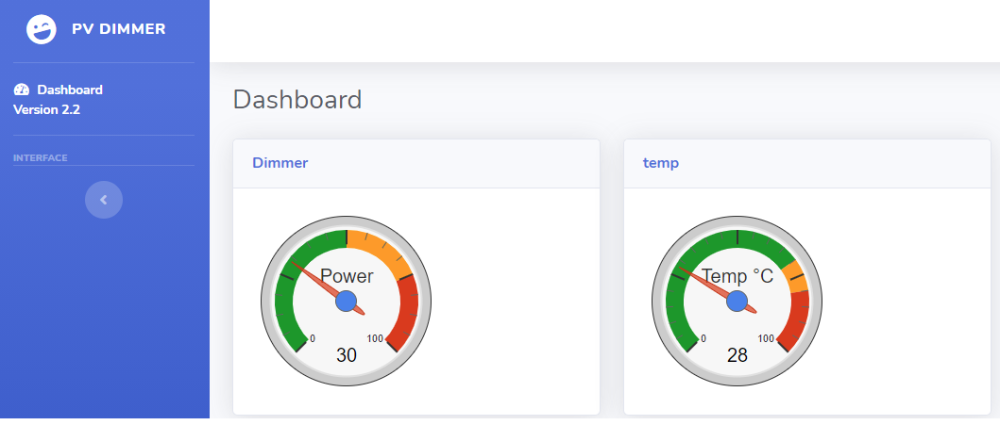
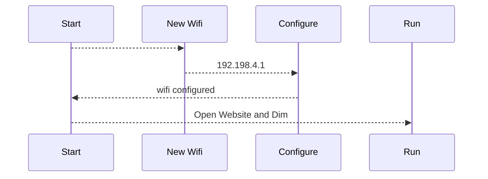
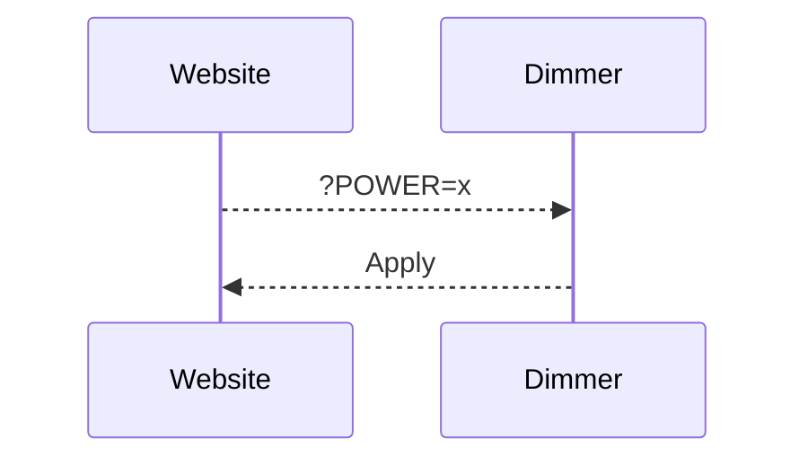
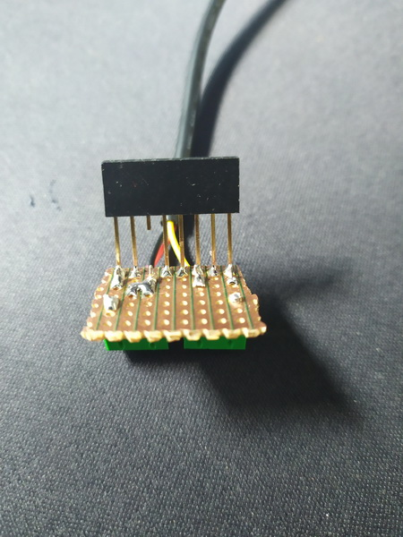
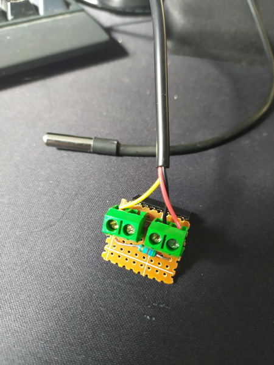
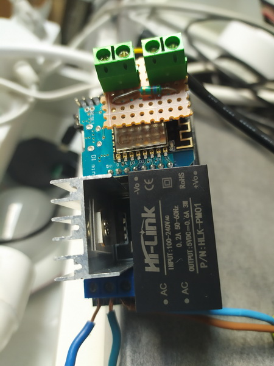
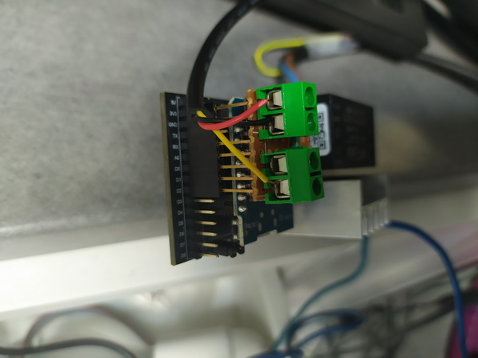

# Numeric dimmer
Shield: [![CC BY-NC-SA 4.0][cc-by-nc-sa-shield]][cc-by-nc-sa]

This work is licensed under a
[Creative Commons Attribution-NonCommercial-ShareAlike 4.0 International License][cc-by-nc-sa].

[![CC BY-NC-SA 4.0][cc-by-nc-sa-image]][cc-by-nc-sa]

[cc-by-nc-sa]: http://creativecommons.org/licenses/by-nc-sa/4.0/
[cc-by-nc-sa-image]: https://licensebuttons.net/l/by-nc-sa/4.0/88x31.png
[cc-by-nc-sa-shield]: https://img.shields.io/badge/License-CC%20BY--NC--SA%204.0-lightgrey.svg

The Online Documentation is [HERE](https://pvrouteur.apper-solaire.org)

# Easyest Methode  

Use Web OTA for upload the code https://ota.apper-solaire.org/ and select your installation.

after upload, connect to AP Wifi "dimmer" and connect to your own network

# Methode for Advanced users ( VS Code)

# 01 - Install of  Visual Studio Code

To transfer the code to the microcontroller (ESP8266 or Robotdyn) it is necessary to install[ Visual Studio Code](https://code.visualstudio.com/).

Once installed, you must install the [PlatformIO](https://platformio.org/install/ide?install=vscode) package which will be used later for all your projects and not only for the Dimmer or the Pv router.


# 02 - Copy or update repository sources

The sources are available on the Github (a code repository web server)

once your Visual Studio is launched, go to your Terminal and type

```shell
git clone https://github.com/xlyric/PV-discharge-Dimmer-AC-Dimmer-KIT-Robotdyn.git
```

it will then clone the repository on your machine and you can adapt the code to your needs and upload it.

```shell
PS C:\Users\c_lyr\Documents\PlatformIO\Projects\1> git clone https://github.com/xlyric/PV-discharge-Dimmer-AC-Dimmer-KIT-Robotdyn.git<br></br>Cloning into 'PV-discharge-Dimmer-AC-Dimmer-KIT-Robotdyn'...<br></br>remote: Enumerating objects: 179, done.<br></br>remote: Counting objects: 100% (179/179), done.<br></br>remote: Compressing objects: 100% (136/136), done.<br></br>Recote: Total 179 (delta 90), reused 119 (delta 38), pack-reused 0 eceiving objects:  75% (135/179)<br></br>Receiving objects: 100% (179/179), 630.36 KiB | 2.58 MiB/s, done.<br></br>Resolving deltas: 100% (90/90), done.
```

you can then go to the directory created during the command

```shell
Resolving deltas: 100% (90/90), done.<br></br>PS C:\Users\c_lyr\Documents\PlatformIO\Projects\1> ls<br></br><br></br>    Directory: C:\Users\c_lyr\Documents\PlatformIO\Projects\1<br></br><br></br>Mode                 LastWriteTime         Length Name<br></br>----                 -------------         ------ ----<br></br>d----          10/03/2022    16:53                pv-router-esp32
```

In the case of an update, you can update your code again with the following command

```shell
git pull
```

[](https://pvrouteur.apper-solaire.org/uploads/images/gallery/2022-03/image-1648136329142.png)

#### Default configuration

There is nothing more to configure in the dimmer,  
you just have to upload the corresponding version to the dimmer.

Wifi configuration is done in Wifi autoconnect.  
He creates a WiFi "dimmer" with a web interface accessible at 192.168.4.1 which allows you to configure your personal WiFi.

# 03 - USB code upload

Uploading is done with Visual Studio Code (VS) using the PlatformIO tab

[](https://pvrouteur.apper-solaire.org/uploads/images/gallery/2022-03/image-1648136519736.png)

During your 1st Upload, you must plug in your ESP, wemos or TTL/USB adapter for programming

There are different versions available depending on what you are using as a dimmer.

[](https://pvrouteur.apper-solaire.org/uploads/images/gallery/2022-05/image-1651775770647.png)

1. PowerSupplyACdimmer is used for old version of Robotdyn dimmer,  
    this is the easiest version to install, it was compatible with the daughterboards supplied with the PV router V1.2 TTGO  
    the recommended maximum power is 5A (and not 8A as indicated by the manufacturer)  
    ( D0 and D1(zc) are used )  
    the Dallas probe uses D2  


    [](https://pvrouteur.apper-solaire.org/uploads/images/gallery/2022-05/image-1651775952029.png)

2. StandAlone is used to later add a Robotdyn dimmer to your ESP. <div>there are different versions supporting more or less power,  
    on the smallest pod, the maximum recommended power is 5A (and not 8A as indicated by the manufacturer)  
    on the 16A model, I think you should not exceed 12A -&gt; ~2500W (to be tested)  
    ( D5 and D6(zc) are used )  
    The Dallas probe uses D7
    [](https://pvrouteur.apper-solaire.org/uploads/images/gallery/2022-05/image-1651775990428.png)
    

3. SSR-JOTTA is used to live control an SSR The - connects to the GND and D1 to the + of the Jotta 
The Dallas probe uses D2
[](https://pvrouteur.apper-solaire.org/uploads/images/gallery/2022-05/image-1651776015419.png)

4. POWERSUPPLY2022 is for the 2022 version of the Robotdyn dimmer.  
    it requires a TTL adapter for the 1st programming.  
    the jumper between vdd and 3.3V must be removed during TTL programming  
    then put back when connecting the assembly to the 220V
    
      
    The Dallas probe uses pin 14 - GND at 16 and 3.3v at 12

    [](https://pvrouteur.apper-solaire.org/uploads/images/gallery/2022-05/image-1651776030344.png)
    

Once the version has been chosen, thanks to VS you will load the firmware and the HTML pages of the router into the microcontroller

[](https://pvrouteur.apper-solaire.org/uploads/images/gallery/2022-03/image-1648136675716.png)

Then you can directly upload the code remotely with the /update page of the router

# 04 -  Remote code upload

Uploading is done with Visual Studio Code (VS) using the PlatformIO tab

[](https://pvrouteur.apper-solaire.org/uploads/images/gallery/2022-03/image-1648136519736.png)

your code being already present on the router, you can now directly generate the binary files to be sent.  
In general, only the General Build is to be done.  
The Build Filesystem Image is only there to update the HTML pages when functionalities evolve.

[](https://pvrouteur.apper-solaire.org/uploads/images/gallery/2022-03/image-1648136931479.png)

once the build is done:

[](https://pvrouteur.apper-solaire.org/uploads/images/gallery/2022-03/image-1648137170040.png)

it shows where the firmware is.

all you have to do is connect with the internet browser on your pv router and go to the /update page

[](https://pvrouteur.apper-solaire.org/uploads/images/gallery/2022-03/image-1648137301517.png)

and upload the firmware

#### Case of a Filesystem update

In the case of updating the Filesystem (HTML file), it's the same procedure, you just have to take the Filesystem binary and select Filesystem.

# 05 - Wi-Fi Setup

The dimmer code uses the Wifi autoconnect library

at the 1st firmware upload, it will create a "dimmer" wifi  
once the user is connected to this Wifi, the browser will redirect to the page http://192.168.4.1

to ask you to configure your Wifi

[](https://pvrouteur.apper-solaire.org/uploads/images/gallery/2022-05/image-1652887349725.png)

it will memorize your Wi-Fi connection confirmations even after a firmware update.

For more details: [https://www.raspberryme.com/wifimanager-avec-esp8266-connexion-automatique-parametre-personnalise-et-gestion-de-votre-ssid-et-mot-de-passe/](https://www.raspberryme.com/wifimanager-avec-esp8266-connexion-automatique-parametre-personnalise-et-gestion-de-votre-ssid-et-mot-de-passe/)


-----
Old Documentation


# # Distant dimmer for discharge PV surplus 

I remaster the distant dimmer with the new ALL in dimmer from Robotdyn ( and support 8A !! ) 

<a href="https://robotdyn.com/diy-iot-ac-dimmer-kit-esp8266-wi-fi-d1-mini-for-ac-110-240v-dimming-control.html"></a>


## Installation

make a git clone of the project and use Visual Studio Code for build and upload to the board. 

### for the dimmer with AC and Wemos on board 
by default, D0 and D1 is used and solt on the board. 
D2 can be used by a Dallas 18b20, I explaint after how to make the small board


### for StandAlone Boards 
D5 D6 and D7 is configured (configured for a lolin NodeMCU) 
<a href="https://robotdyn.com/diy-iot-ac-dimmer-kit-esp8266-wi-fi-d1-mini-for-ac-110-240v-dimming-control.html"></a>

On Visual Studio upload firmware AND filesystem. 

 

###  First Start

at the first start, the wemos use the Wifimanager for configure the Wifi. 
It create a new Wifi AP 'dimmer', connect on it at 192.168.4.1 and configure your Wifi



### Update

You can update your firmware directly by the url /update 
it's open OTA web page, and you can push the firmware or filesystem. 

for generating firmware, on Visualstudio/ plateform IO, use the build option 
the build firmware is stored at .pio\build\d1_mini\firmware.elf folder 


## CHANGE POWER ( for control )
You can control the power by an HTTP request : 

Control :  http://IP/?POWER=xx
the max power limit is configured on the config.html page 


you can send the command by you domotic server or your pv router 

### Use with Pv router 

You can control directly the dimmer with this PV router code 
https://github.com/xlyric/pv-router-esp32

It use this pv routeur, <br>
<a href="https://www.helloasso.com/associations/apper/formulaires/4"></a>
<br>
<a href="https://www.helloasso.com/associations/apper/formulaires/4">The board was sold by a French Association ( APPER ) </a> and a TTGO Tdisplay, A SCT013-30 and AC12 power supply need to be bought separatly 
The board is open source and freely for non commercial usage. 

### Chaine dimmer
You can now chaine multiple dimmers
2 options : 
equal : send the same command to the other dimmer
delest (surplus) : send command to the other dimmer when the maximum power is reached on the first dimmer. 

### Dallas probe
You can use dallas 18b20 Probe for limit the temperature of your water tank
the limit temp configuration is on /config.html page. 

### MQTT configuration
if you need a password for connect to your mosquitto (MQTT) serveur, the information of connection is in the file config.h 

## Note on Robotdyn librairie
with actual version of arduino GUI or VS, the librairie not working ( memory problem ) 
I modify the librairie and is called in the lib_deps variable
lib_deps = https://github.com/xlyric/RBDDimmer

and called by plateformio.ini file

## Create the Dallas board

on a test plate, solder the long female pin from your Wemos D1 mini 

 

( I cut the 3rd pin ( RX ) I use the place for GND connector ) 

solder a 5.6kOhms resistance between 3.3V hole ( first hole ) 
and D2 ( last hole ) 
and sold 3.3V - GND and D2 to your Dallas 18b20 
or add connector 

 

you can now connect the board to the main board 




### Print Dallas board
A printed Board look like this 


