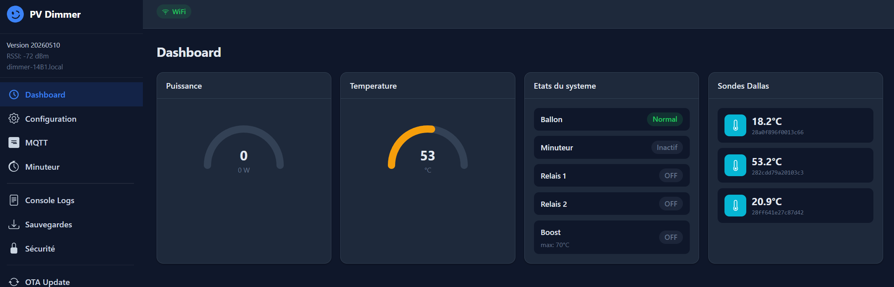

# PV Router - Dimmer ESP8266/ESP32

[](http://creativecommons.org/licenses/by-nc-sa/4.0/)
[](https://github.com/xlyric/PV-discharge-Dimmer-AC-Dimmer-KIT-Robotdyn/stargazers)

[🇫🇷 Version Française](#français) | [🇬🇧 English Version](#english)

## Français

### 🌞 Vue d'ensemble

Ce projet est la partie régulation pour un routeur photovoltaïque intelligent conçu pour gérer l'excès d'énergie solaire en contrôlant des variateurs AC et des relais statiques (SSR) sur des microcontrôleurs ESP8266/ESP32.
Son utilisation classique sert à chauffer des ballons de type ECS.

### ✨ Caractéristiques principales

- 🔋 Gestion intelligente du surplus d'énergie solaire
- 🌐 Interface web complète et responsive
- 🔗 Intégration MQTT avancée
- 💻 Support multiplateforme (ESP8266/ESP32)
- 📡 Configuration WiFi automatique
- 🎛️ Contrôle de puissance précis
- 🌡️ Surveillance de la température avec sondes Dallas. 
- 🔒 Mécanismes de sécurité intégrés



### 🖥️ Configurations matérielles supportées

1. **StandAlone (ESP8266)**
   - Plateforme : ESP8266 (Wemos D1 Mini)
   - Variantes de puissance : 5A et 16A (jusqu'à ~2500W Sur SSR Random)
   - Compatible avec variateur Robotdyn ( Deprecated )
   - Possibilité d'utiliser 3 SSR Random
   - Utilisez la carte fournis par l'association
   
2. **SSR-Burst-Revisited (ESP8266)**
   - Plateforme : ESP8266 (Wemos D1 Mini)
   - Contrôle de relais statique en zéro crossing
   - Utilisez la carte fournis par l'association

3. **ESP32 Development (arduino-esp32dev)**
   - Plateforme : ESP32 ( Wemos D1 Mini32 )
   - Variantes de puissance : 5A et 16A (jusqu'à ~2500W Sur SSR Random)
   - Possibilité d'utiliser 3 SSR Random
   - Intégration OLED
   - Utilisez la carte fournis par l'association

4. **ESP32 Zero Crossing (arduino-esp32dev-ZC)**
   - Plateforme : ESP32 ( Wemos D1 Mini32 )
   - Contrôle de relais statique en zéro crossing
   - Utilisez la carte fournis par l'association

### 🚀 Installation rapide

#### Méthode 1 : Web OTA

1. Visitez https://ota.apper-solaire.org/
2. Sélectionnez votre installation
3. Après upload, connectez-vous au WiFi "dimmer"
4. Configurez votre réseau personnel

#### Méthode 2 : Visual Studio Code

1. Installez [Visual Studio Code](https://code.visualstudio.com/)
2. Installez [PlatformIO](https://platformio.org/install/ide?install=vscode)
3. Clonez le dépôt :
   ```bash
   git clone https://github.com/xlyric/PV-discharge-Dimmer-AC-Dimmer-KIT-Robotdyn.git
   ```
4. Ouvrez le projet avec PlatformIO
5. Sélectionnez votre configuration
6. Uploadez le firmware

#### 🔄 Mises à jour
- Versions officielles disponibles sur : [GitHub Releases](https://github.com/xlyric/PV-discharge-Dimmer-AC-Dimmer-KIT-Robotdyn/releases)
- Vous pouvez déployer directement la mise à jour par ota en allant sur la page web /update du dimmer
- Suivez les notes de version pour connaître les dernières améliorations et corrections

### 📡 Configuration WiFi

- Premier démarrage : Point d'accès WiFi "dimmer"
- Connectez-vous à `192.168.4.1`
- Configurez votre réseau personnel

### 🎛️ API de Contrôle

#### Contrôle de Puissance
- `http://IP/?POWER=xx` : Définir le niveau de puissance (0-100%)
- `http://IP/state` : Obtenir l'état du système
- détailles des autres API dans le répertoires doc 

### 🛠️ Dépannage

#### Problèmes courants
- ❌ Pas de connexion WiFi
  - Vérifiez les identifiants réseau
  - Redémarrez le périphérique
- 🔌 Problèmes de connexion matérielle
  - Vérifiez les branchements
  - Assurez-vous que les pilotes USB sont installés
- 🌡️ Problèmes de sonde de température
  - Vérifiez le câblage de la sonde Dallas
  - Assurez-vous que la résistance de pull-up est correcte

#### Outils de diagnostic
- Consultez les logs système via `/log.html`
- Vérifiez les paramètres réseau
- Utilisez le point de restauration WiFi si nécessaire

### 🤝 Contribution

1. Forkez le projet
2. Créez une branche de fonctionnalité (`git checkout -b feature/AmazingFeature`)
3. Commitez vos modifications (`git commit -m 'Add some AmazingFeature'`)
4. Poussez votre branche (`git push origin feature/AmazingFeature`)
5. Ouvrez une Pull Request

### 📦 Dépendances

- PlatformIO
- ESP8266/ESP32 Arduino Core
- ArduinoJson
- OneWire
- DallasTemperature

### 🛒 Achat du Matériel

#### Kit Complet Recommandé
- Carte électronique vendue par l'association [APPER](https://www.helloasso.com/associations/apper/formulaires/7)


- Composants additionnels nécessaires :
  - Wemos D1 mini ou Wemos ESP32
  - Sonde Dallas 18B20
  - SSR Random 
- Composants fournis lors de la commande :
  - Support din
  - Connecteur jwt pour le SSR

#### Détails des Composants
- **Carte de base** : Routeur PV open-source
- **Microcontrôleur** : ESP8266 ou ESP32
- **Communication** : WiFi, MQTT
- **Capteurs** : Temperature (Dallas)

#### Options d'Achat
- [Boutique APPER](https://www.helloasso.com/associations/apper/formulaires/7), l'achat de la carte ouvre droit à un crédit d'impot de 66% en France
- Composants individuels sur plateformes de vente en ligne

#### Considérations
- Prix approximatif : 25€ pour la carte et environ 15€ pour le reste des composants
- Assemblage : Niveau débutant à intermédiaire ( savoir souder ou me contacter )
- Usage : Routage intelligent de l'énergie solaire

### 🏆 Crédits

- Développé gracieusement par la Société Sunstain Tech Solution pour la communauté [APPER](https://www.apper-solaire.org/)
- Contributions de la communauté open-source
- Projet open-source à usage non commercial

### 📄 Licence

Ce projet est sous licence [Creative Commons Attribution-NonCommercial-ShareAlike 4.0 International](http://creativecommons.org/licenses/by-nc-sa/4.0/)

---

## English

### 🌞 Overview

An intelligent photovoltaic router designed to manage solar energy surplus by controlling AC dimmers and Solid State Relays (SSRs) on ESP8266/ESP32 microcontrollers.

### ✨ Key Features

- 🔋 Intelligent solar energy surplus management
- 🌐 Comprehensive and responsive web interface
- 🔗 Advanced MQTT integration
- 💻 Multi-platform support (ESP8266/ESP32)
- 📡 Automatic WiFi configuration
- 🎛️ Precise power control
- 🌡️ Temperature monitoring with Dallas sensors
- 🔒 Integrated security mechanisms


### 🖥️ Supported Hardware Configurations

1. **StandAlone (ESP8266)**
   - Platform: ESP8266 (D1 Mini)
   - Power variants: 5A and 16A (up to ~2500W)
   - Uses D5 and D6 (zero crossing)
   - Dallas sensor on D7
   - Compatible with Robotdyn dimmer

2. **SSR-Burst-Revisited (ESP8266)**
   - Platform: ESP8266 (D1 Mini)
   - Solid State Relay (SSR) control
   - Zero crossing support
   - GND and D1 connection
   - Dallas sensor on D2

3. **ESP32 Development (arduino-esp32dev)**
   - Platform: ESP32
   - Board: Wemos D1 Mini32
   - Advanced configuration support
   - OLED integration
   - Zero crossing options

4. **ESP32 Zero Crossing (arduino-esp32dev-ZC)**
   - Platform: ESP32
   - Board: Wemos D1 Mini32
   - Specific Zero Crossing mode
   - Solid State Relay support
   - Advanced configuration

### 🚀 Quick Installation

#### Method 1: Web OTA

1. Visit https://ota.apper-solaire.org/
2. Select your installation
3. After upload, connect to WiFi "dimmer"
4. Configure your personal network

#### Method 2: Visual Studio Code

1. Install [Visual Studio Code](https://code.visualstudio.com/)
2. Install [PlatformIO](https://platformio.org/install/ide?install=vscode)
3. Clone the repository:
   ```bash
   git clone https://github.com/xlyric/PV-discharge-Dimmer-AC-Dimmer-KIT-Robotdyn.git
   ```
4. Open the project with PlatformIO
5. Select your configuration
6. Upload the firmware

#### 🔄 Updates
- Official versions available at: [GitHub Releases](https://github.com/xlyric/PV-discharge-Dimmer-AC-Dimmer-KIT-Robotdyn/releases)
- You can directly deploy the update via ota by going to the dimmer's /update web page
- Follow release notes for latest improvements and fixes

### 📡 WiFi Configuration

- First startup: WiFi access point "dimmer"
- Connect to `192.168.4.1`
- Configure your personal network

### 🎛️ Control API

#### Power Control
- `http://IP/?POWER=xx`: Set power level (0-100%)
- `http://IP/state`: Get system status
- details of other APIs in the doc directory

### 🛠️ Troubleshooting

#### Common Issues
- ❌ No WiFi connection
  - Check network credentials
  - Restart the device
- 🔌 Hardware connection problems
  - Check connections
  - Ensure USB drivers are installed
- 🌡️ Temperature sensor issues
  - Verify Dallas sensor wiring
  - Ensure pull-up resistor is correct

#### Diagnostic Tools
- Check system logs via `/log.html`
- Verify network settings
- Use WiFi restoration point if necessary

### 🤝 Contributing

1. Fork the project
2. Create a feature branch (`git checkout -b feature/AmazingFeature`)
3. Commit your changes (`git commit -m 'Add some AmazingFeature'`)
4. Push to the branch (`git push origin feature/AmazingFeature`)
5. Open a Pull Request

### 📦 Dependencies

- PlatformIO
- ESP8266/ESP32 Arduino Core
- ArduinoJson
- OneWire
- DallasTemperature

### 🛒 Hardware Purchase

#### Recommended Complete Kit
- Electronic board sold by [APPER Association](https://www.helloasso.com/associations/apper/formulaires/7)


- Additional required components:
  - Wemos D1 mini or Wemos ESP32
  - Dallas 18B20 Probe
  - SSR Random
- Components provided with the order:
  - Din support
  - JWT connector for SSR

#### Component Details
- **Base Board**: Open-source PV Router
- **Microcontroller**: ESP8266 or ESP32
- **Communication**: WiFi, MQTT
- **Sensors**: Temperature (Dallas)

#### Purchase Options
- [APPER Shop](https://www.helloasso.com/associations/apper/formulaires/7), buying the board gives a 66% tax credit in France
- Individual components on online marketplaces

#### Considerations
- Approximate Price: 25€ for the board and about 15€ for other components
- Assembly: Beginner to Intermediate level (soldering skills required or contact for help)
- Usage: Intelligent solar energy routing

### 🏆 Credits

- Generously developed by Sunstain Tech Solution for the [APPER](https://www.apper-solaire.org/) community
- Open-source community contributions
- Non-commercial open-source project

### 📄 License

This project is licensed under the [Creative Commons Attribution-NonCommercial-ShareAlike 4.0 International License](http://creativecommons.org/licenses/by-nc-sa/4.0/)
